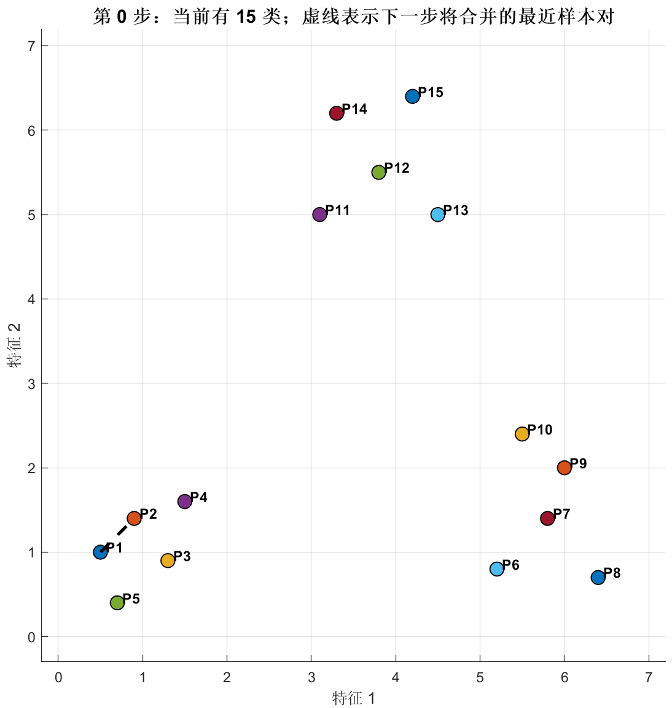

<h1 align="center">Clustering-Matlab-Demo</h1>

<p align="center">
  <b>一个用于演示分级聚类 / 层次聚类过程的 MATLAB 可交互 Demo</b>
</p>

<p align="center">
  
  
  <a href="https://github.com/LiMingKuan-UESTC/Clustering-Matlab-Demo/stargazers">
    
  </a>
</p>

本项目主要面向算法入门、课堂展示和课程实验场景，希望用更直观的方式展示聚类合并过程，而不是一开始就堆叠复杂公式和理论说明。

---

## 效果展示

<p align="center">
  
</p>

---

## 项目亮点

* **交互式演示聚类过程**
  支持上一步、下一步、自动播放、暂停、重置，可以逐步观察样本点如何被合并成不同类别。

* **聚类过程直观可见**
  每一步都会显示当前类数、当前聚类结果、即将合并的对象以及对应距离，适合边运行边讲解。

* **支持树状图展示**
  可以通过按钮生成分级聚类树状图，帮助理解完整的合并过程和最终分类结果。

* **单文件即可运行**
  当前核心功能集中在 `demo.m` 中，下载后可以直接运行，便于查看、修改和二次开发。

* **不依赖 Statistics Toolbox**
  聚类过程和树状图绘制均为手写实现，更适合学习算法流程和代码逻辑。

* **中文界面与中文注释**
  对中文学习者更友好，适合课程作业、实验报告和课堂演示。

---

## 快速开始

### 1. 克隆仓库

```bash
git clone https://github.com/LiMingKuan-UESTC/Clustering-Matlab-Demo.git
```

### 2. 进入项目目录

```matlab
cd Clustering-Matlab-Demo
```

### 3. 运行 Demo

```matlab
demo
```

运行后会打开交互窗口，可以通过底部按钮控制聚类演示过程。

---

## 当前功能

| 功能        | 状态  | 说明                           |
| --------- | --- | ---------------------------- |
| 分级聚类演示    | 已完成 | 当前采用 single-linkage / 最小距离准则 |
| 二维样本可视化   | 已完成 | 在图中展示样本点、类别和合并关系             |
| 上一步 / 下一步 | 已完成 | 支持逐步查看聚类过程                   |
| 自动播放 / 暂停 | 已完成 | 支持自动演示聚类合并过程                 |
| 重置        | 已完成 | 可回到初始状态                      |
| 当前类别列表    | 已完成 | 右侧实时显示当前各类包含的样本              |
| 合并信息展示    | 已完成 | 显示当前步数、类数、合并距离等信息            |
| 树状图展示     | 已完成 | 手写树状图绘制，不依赖 `dendrogram` 函数  |
| GIF 展示    | 已完成 | 后续上传演示 GIF 后加入 README        |
| 自定义数据输入   | 待完善 | 当前主要通过修改代码中的样本数据实现           |

---

## 适合场景

* 聚类算法入门学习
* 机器学习 / 数据挖掘课程演示
* MATLAB 可视化交互 Demo
* 分级聚类实验报告
* 教学课件或课堂展示

---

## 项目结构

```text
Clustering-Matlab-Demo
├── assets/
│   └── display.gif     # 项目运行效果演示
├── demo.m              # 主程序：交互式层次聚类演示
├── README.md           # 项目说明文档
└── LICENSE             # 开源协议
```

---

## 后续计划

* [ ] 补充当前示例数据说明，方便理解样本点分布
* [ ] 支持更方便地修改目标聚类数 `targetK`
* [ ] 支持用户自定义输入二维样本点
* [ ] 在功能稳定后发布第一个版本标签，例如 `v0.1.0`
* [ ] 考虑增加不同 linkage 准则的切换，例如 single-linkage、complete-linkage、average-linkage

---

## License

本项目基于 Apache-2.0 License 开源。
